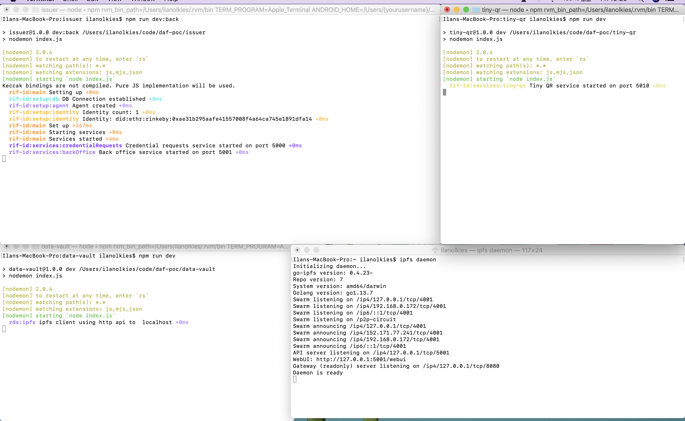
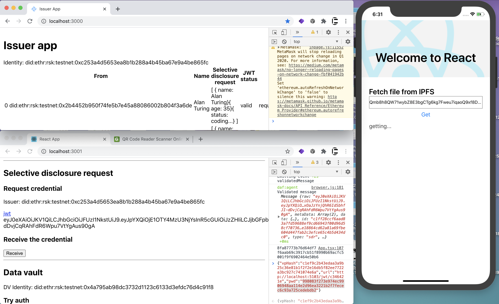

# RIF Identity POC

The project has different modules that run together form the RIF Identity main flow:

1. Holder requests a credential
2. Issuer issues that credential
3. Holder retrieves the credential
4. Holder stores it in the data-vault
5. Holder presents a QR code using tiny-QR service
6. Verifier validates presentation retrieving from tiny-QR service

## Run

1. Start the Issuer. Go to `./issuer` and follow the instructions
2. Start the Data Vault. Go to `./data-vault` and follow the instructions
3. Start the tiny-QR service. Go to `./tiny-qr` and follow the instructions

> For development, commands appended with `:dev` run a watch mode

There are also two apps to test the flow:

- `holder/holder-app` is a react app that allows to fulfill the whole flow but retrieve from IPFS
- `ipfs/IPFSApp` is a react native app that uses a gateway to retrieve a file from IPFS

Both can be run following its readmes.

After starting all services you should get something like this

If you started the front end apps you should get this

## Usage

- Create identity

  1. Create an identity in the holder app
  2. You will see your DID

- Request a credential

  1. Click on request and wait until a JWT shows up
  2. Reload the issuer app and see a new entry for the requested credential
  3. Back in the holder app, click receive the credential and wait until the payload is decoded

- Store credential in data vault

  1. Click try auth to check authentication flow
  2. Click on store to store the credential
  3. Click on retrieve to retrieve all stored credentials

- Verify content hashes

  1. Open the IPFS app
  2. Paste a hash
  3. Click on get and wait - it can take a while

- Present credential

  1. After issuing a credential (not necessarily synced to the data vault), click on present
  2. A QR will be displayed
  3. You can read

- Verify a presentation

  1. Scan the QR and get its JSON data - you can use a tool like [this one](https://www.ginifab.com/feeds/qr_code/qr_code_scanner.html)
  2. Copy the fields values and paste them in the text boxes
  3. Click on verify - it will show 'Ok' or 'Error'
