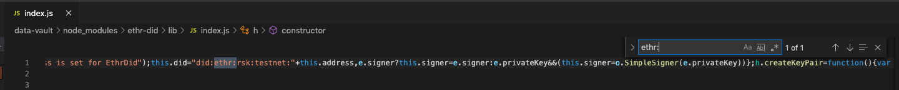

# Convey service

Large contents don't fit in QR codes so this service is designed to receive an encrypted file, store (and pin) it in IPFS and also store the file in memory. It returns the cid of the stored file and a convey-uri that indicates that this kind of files should be gotten from a convey service implementation


**Send a message**

1. _Alice_ symmetrically encrypts the file and saves the ecKey
2. _Alice_ sends the encrypted file to the Convey service
3. The Convey services receives the file, stores it in IPFS and caches it. It sends the CID (content identifier) of the file to _Alice_.
4. _Alice_ calculates the file CID of the file and compares it to the response of the Convey service
5. _Alice_ shares a QR with _Bob_ containing an uri as `convey://QmPChd2hVbrJ6bfo3WBcTW4iZnpHm8TEzWkLHmLpXhF68A#ecKey`
6. _Alice_ show a QR representing this uri

**Receive a message**

1. _Bob_ scans the QR and gets the uri, _Bob_ received the encrypted file’s CID and the decryption key.
2. _Bob_ resolves the uri
3. If _Bob_ knows a Convey service
    _Bob_ requests file to his known Convey service
    If Convey service responses the file content
      _Bob_ has the encrypted file => go to step 4
    Else 
      _Bob_ requests file to IPFS
      If IPFS responses the file content
        _Bob_ has the encrypted file => go to step 4
      Else
        _Bob_ could not find the file => reject
4. _Bob_ decrypts the file
5. _Bob_ has the file content

**Remarks**
- CIDs are hashes of files. Sharing the CID results in message integrity.
- QR codes are scanned by proximity. Sharing an encryption key via QR is secure and enables the privacy of messages.


# Run

1. Install deps:

  ```
  npm i
  ```

  `postinstall` is running a script to append `"rsk:testnet"` to `"did:ethr:"` methods name

  To do it manually, remove `postinstall` script before running installing, then find this in `node_modules/ethr-did/lib//index.js`

  

3. Create an empty .env file with the following:

```
  CONVEY_PORT=port where the service will be served
  LOG_FILE=relative path of the log file
  LOG_ERROR_FILE=relative path of the errors log file
  IPFS_PORT=port where the IPFS node API is served
  IPFS_HOST=host of the IPFS node
  NODE_ENV=running environment
```

Example:
```
  CONVEY_PORT=5104
  LOG_FILE=./log/convey.log
  LOG_ERROR_FILE=./log/convey.error.log
  IPFS_PORT=5001
  IPFS_HOST=localhost
  NODE_ENV=dev
```

3. Run

  ```
  npm run start
  # or npm run start:dev
  ```

## Test

1. Install deps

  ```
  npm i
  ```

2. Install IPFS CLI. Find your option: https://docs.ipfs.io/how-to/command-line-quick-start/.

3. Init IPFS (once after installing IPFS)

  ```
  ipfs init
  ```

4. Start IPFS Daemon

  ```
  ipfs daemon
  ```

5. Run tests

  ```
  npm test
  ```

## Lint

```
npm run lint
```

