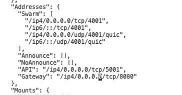

# Production deploy

Deploy all RIF Identity services using Docker containers and Docker compose.

This services are expected to be run:

- `rif-identity-ipfs-testnet` 
    - Two ports opened: 
        - 5001 not public - it is accessed only by `rif-identity-datavault-testnet`
        - 8080 is public
- `rif-identity-datavault-testnet`
- `rif-identity-issuer-back-testnet`
- `rif-identity-convey-testnet`

First clone the repo

```
git@github.com:rsksmart/rif-identity-services.git
cd rif-identity-services
```

Now setup the services:

#### Data vault

1. Go to `./services/data-vault`
2. Create a `.env` file with

    ```
    PRIVATE_KEY=COMPLETE WITH YOUR PRIVATE KEY
    ADDRESS=COMPLETE WITH YOUR ADDRESS
    RPC_URL=https://did.testnet.rsk.co:4444
    IPFS_PORT=5001
    IPFS_HOST=rif-identity-ipfs-testnet
    PORT=5102
    DATABASE_FILE=./db/data-vault-mapper.sqlite
    LOG_FILE=./log/data-vault.log
    LOG_ERRORS_FILE=./log/data-vault.error.log
    NODE_ENV=production
    AUTH_EXPIRATION_TIME=300000
    ```

> The private key is stored raw.

> `IPFS_HOST` and `IPFS_PORT` refer to the IPFS container named `rif-identity-ipfs-testnet`. You should put here the container name that will be run in the same network as this service, or the dns name if running in another machine.

#### Issuer services

1. Go to `./services/issuer`
2. Create a `.env` file with

    ```
    SECRET_BOX_KEY=COMPLETE WITH YOUR SECRET BOX KEY
    CREDENTIAL_REQUESTS_PORT=5100
    REACT_APP_BACKOFFICE_PORT=5101
    RPC_URL=https://did.testnet.rsk.co:4444
    ADMIN_USER=COMPLETE WITH YOUR ADMIN USER
    ADMIN_PASS=COMPLETE WITH YOUR ADMIN PASS
    LOG_FILE=./log/issuer-backend.log
    LOG_ERRORS_FILE=./log/issuer-backend.error.log
    DB_FILE=./db/issuer.sqlite
    NODE_ENV=production
    AUTH_EXPIRATION_HOURS=10
    CHALLENGE_EXPIRATION_SECONDS=300
    MAX_REQUESTS_PER_TOKEN=20
    ```


#### Convey services

1. Go to `./services/convey`
2. Create a `.env` file with

    ```
    CONVEY_PORT=5104
    LOG_FILE=./log/convey.log
    LOG_ERROR_FILE=./log/convey.error.log
    IPFS_PORT=5001
    IPFS_HOST=rif-identity-ipfs-testnet
    NODE_ENV=dev
    PRIVATE_KEY=COMPLETE WITH YOUR PRIVATE KEY
    RPC_URL=https://did.testnet.rsk.co:4444
    AUTH_EXPIRATION_HOURS=10
    CHALLENGE_EXPIRATION_SECONDS=300
    MAX_REQUESTS_PER_TOKEN=20
    ```

> The private key is stored raw.

> `IPFS_HOST` and `IPFS_PORT` refer to the IPFS container named `rif-identity-ipfs-testnet`. You should put here the container name that will be run in the same network as this service, or the dns name if running in another machine.

#### IMPORTANT NOTE:

If you don't use the default values provided for the `DB` and `LOGS` paths, please make sure to update also the right hand of `docker-compose.yml`'s `volumes` lines. They must be kept in sync

## Run docker

1. Create dirs where the logs and dbs will be saved:

```
mkdir /var/db/rif-identity # you may need sudo
mkdir /var/log/rif-identity
```

2. Give permissions for everyone to write in those created folders

```
chmod -R 777 /var/db/rif-identity/  # you may need sudo
chmod -R 777 /var/log/rif-identity/
```

3. Open Docker Preferences -> File Sharing and add just created dirs to the list of available directories

4. Click on `Apply & Restart`

5. Go to `./` (root folder)
6. Build the containers

    ```
    docker-compose build
    ```
  
7. Compose

    ```
    docker-compose up -d
    ```
  
8. Enable access to IPFS node container port 5001

    ```
    docker container ls
    # copy the id of the container named rif-identity-ipfs:latest
    docker exec -it COPIED-ID bash # e.g. 967eb3ce4730
    cd /root/.ipfs/
    apt update
    apt install vim
    vim config
    ```

    Update `“Addresses” -> “API”` and open ip4 port. Set `“API”: “/ipv4/0.0.0.0/tcp/5001"`

    Update `“Addresses” -> Gateway` and open ip4 port. Set `“API”: “/ipv4/0.0.0.0/tcp/8080"`

    Before the update
    
    

    After the update

    

    Save the file and exit the container

    ```
    exit
    ```

    Now restart IPFS docker

    ```
    docker restart COPIED-ID
    ```

    **IMPORTANT NOTE**
    
    This container will expose two ports:

    Port 5001 should accesible only from `rif-identity-datavault-testnet` and from `rif-identity-convey-testnet` _(this service is not merged yet, will be merged during these days)_

    Port 8080 should be open to everyone, is our IPFS gateway and will be accessed by the mobile app, would be great if it is routed through the port 80. 
    
Done!
