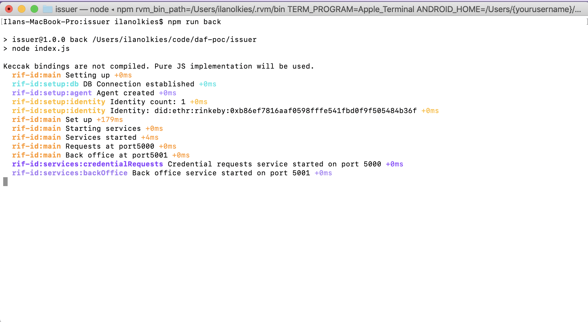
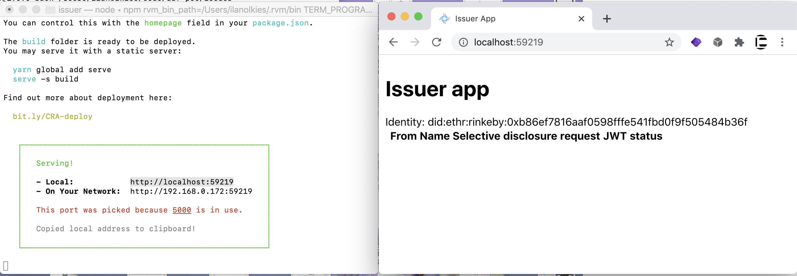

<p align="middle">
    
</p>
<h3 align="middle">W3C Verifiable Credential Issuer app</h3>
<p align="middle">
    RIF Self-sovereign identity
</p>

Application that allows receiving credential issuance requests and approving them manually.

## Features

- **Request credentials service**: receives Selective disclosure requests with simple key-value claims. This is a public service.
- **Back office**: now it requires a simple HTTP login to access a dashboard to allow or deny credentials

## Run

The issuer has 2 processes running:

1. Back end with two express apps, one for the request credential HTTPS service and the other to serve information to the front end
2. Front end: react app. It connects to the back end and has a list of credential requests - this is WP

> All commands can be run prepending  `:dev` for watch mode

### Back end

1. Setup: create a `.env` file with

  ```
  DEBUG= rif-id:* for app logging - * for all logs
  CREDENTIAL_REQUESTS_PORT= port to run credential requests service
  SECRET_BOX_KEY= 32 random bytes in hex representation - encryption key
  RPC_URL= rsk testnet rpc url - the one in the example was tested and works
  DEBUG= regexp for debugging logs
  ADMIN_PASS= a secure password for admin user - used for basic http auth
  ```

  Example

  ```
  CREDENTIAL_REQUESTS_PORT=5100
  REACT_APP_BACKOFFICE_PORT=5101
  SECRET_BOX_KEY=29739248cad1bd1a0fc4d9b75cd4d2990de535baf5caadfdf8d8f86664aa830c
  RPC_URL=https://did.testnet.rsk.co:4444
  DEBUG=rif-id:*
  ADMIN_PASS=admin
  ```

2. Install:

  ```
  npm i
  ```

3. Start

  ```
  npm run back
  # or back:dev
  ```

You should see the terminal running like this



Also a database file will be created. `issuer.sqlite`

### Front end

1. It is a react app, browse into it

  ```
  cd app
  ```

2. Please fill the back office service port again :/, crate a `.env` file

  ```
  REACT_APP_BACKOFFICE_PORT=5101
  ```

  or the port you used.

3. Install deps

  ```
  yarn
  ```

4. Run the app. It will build the app and start a `serve` server for productive command, or react watch mode for dev

  ```
  yarn front
  # npm run front:dev
  ```



### All together

```
npm run all
npm run all:dev
```
