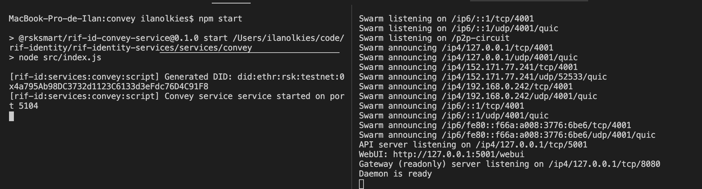

<p align="middle">
    
</p>
<h3 align="middle"><code>@rsksmart/rif-id-convey-service</code></h3>
<p align="middle">
    Public transport layer for JWTs using IPFS
</p>

Large contents don't fit in QR codes so this service is designed to receive an encrypted file, store it in IPFS and also store the file in memory. It returns the cid of the stored file and a convey-uri that indicates that this kind of files should be gotten from a convey service implementation

Find the protocol specification [here](https://github.com/rsksmart/rif-identity-docs/blob/master/ssi/specs/convey-service.markdown).

# Run

1. Install deps (if you didn't run `setup` on root):

  ```
  npm i
  ```

2. Create an .env file with the following:

  ```
  PRIVATE_KEY= 32 bytes key that will be used to sign auth tokens (without 0x)
  ```

  Example

  ```
  PRIVATE_KEY=c0d0bafd577fe198158270925613affc27b7aff9e8b7a7050b2b65f6eefd3083
  ```

  See [optional-configuration](#optional-configuration) to configure service internals.

3. Run

  ```
  npm run start
  # or npm run start:dev
  ```



## Test

1. Install deps

  ```
  npm i
  ```

2. Install IPFS CLI. Find your option: https://docs.ipfs.io/how-to/command-line-quick-start/.

3. Init IPFS (once after installing IPFS)

  ```
  ipfs init
  ```

4. Start IPFS Daemon

  ```
  ipfs daemon
  ```

5. Run tests

  ```
  npm test
  ```

## Lint

```
npm run lint
```

## Optional configuration


Optional parameters for the service:

```
CONVEY_PORT=port where the service will be served

RPC_URL=rpc url to resolve Ethr DID identities
NETWORK_NAME=of the rpc url

CHALLENGE_EXPIRATION_SECONDS=auth challenge expiration time in seconds
AUTH_EXPIRATION_HOURS=auth token expiration time in hours
MAX_REQUESTS_PER_TOKEN=max amount of requests allowed per token

IPFS_HOST=host of the IPFS node
IPFS_PORT=port where the IPFS node API is served

NODE_ENV=running environment for logger
LOG_FILE=relative path of the log file
LOG_ERROR_FILE=relative path of the errors log file
```

Example:

```
PRIVATE_KEY=c0d0bafd577fe198158270925613affc27b7aff9e8b7a7050b2b65f6eefd3083

CONVEY_PORT=5104

RPC_URL=https://did.testnet.rsk.co:4444
NETWORK_NAME=rsk:testnet

IPFS_HOST=localhost
IPFS_PORT=5001

AUTH_EXPIRATION_HOURS=10
CHALLENGE_EXPIRATION_SECONDS=300
MAX_REQUESTS_PER_TOKEN=20

NODE_ENV=dev
LOG_FILE=./log/convey.log
LOG_ERROR_FILE=./log/convey.error.log
```

## Remarks

- Check if this line when getting a challenge could be improved (`setTimeout(() => delete challenges[did], env.challengeExpirationInSeconds * 1000)`). The goal is to do not save challenges for a long time, maybe a better idea is to add a new endpoint to clean it up.
