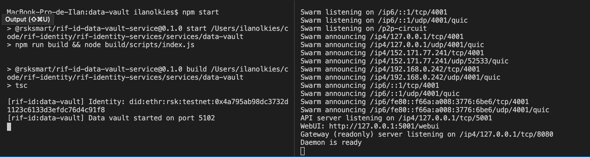

<p align="middle">
    
</p>
<h3 align="middle"><code>@rsksmart/rif-id-data-vault-service</code></h3>
<p align="middle">
    A Data vault First approach. This service uses an IPFS node to pin files.
</p>


After the _store_ process the holder can verify the file was uploaded accessing to IPFS. When a recovery is required, the server will response all the CIDs of the files that were ever stored by the DID, the DID holder can then retrieve the files from IPFS. To maintain this flow a local DB maps DIDs to CIDs.

Read the service documentation [here](https://github.com/rsksmart/rif-identity-docs/tree/master/data-vault)

> Alert: anyone in possession of a DID can used the server to upload files, now it has just file-size restrictions

## Run

1. Install deps

  ```
  npm i
  ```

2. Install IPFS CLI. Find your option: https://docs.ipfs.io/how-to/command-line-quick-start/.

3. Init IPFS (once)

  ```
  ipfs init
  ```

4. Start IPFS Daemon

  ```
  ipfs daemon
  ```

5. Configure: create a `.env` file with

  ```
  PRIVATE_KEY=COMPLETE WITH YOUR PRIVATE KEY
  ADDRESS=COMPLETE WITH YOUR ADDRESS
  ```

  Example:

  ```
  PRIVATE_KEY=c0d0bafd577fe198158270925613affc27b7aff9e8b7a7050b2b65f6eefd3083
  ADDRESS=0x4a795ab98dc3732d1123c6133d3efdc76d4c91f8
  ```

  See [optional configuration](#optional-configuration) of service internals

6. In another terminal, start data-vault:

  ```
  npm run start
  # or npm run start:dev
  ```

  > Use `npm run start` for no `nodemon`

You should now see



## Test

1. Install deps

  ```
  npm i
  ```

2. Install IPFS CLI. Find your option: https://docs.ipfs.io/how-to/command-line-quick-start/.

3. Init IPFS (once after installing IPFS)

  ```
  ipfs init
  ```

4. Start IPFS Daemon

  ```
  ipfs daemon
  ```

5. Run tests

  ```
  npm test
  ```

## Lint

```
npm run lint
```

## Optional configuration

Optional parameters:

```
AUTH_EXPIRATION_TIME= fixed time for auth tokens to expire in
RPC_URL= rsk testnet rpc url
PORT= to run the data vault
IPFS_PORT= port of an http IPFS gateway
IPFS_HOST=host of an IPFS gateway - should be used if running with Docker
DATABASE_FILE=relative path of the sqlite database
LOG_FILE=relative path of the log file
LOG_ERRORS_FILE=relative path of the error log file
NODE_ENV=dev or production environment, used for logging purposes
```

Example

```
PRIVATE_KEY=c0d0bafd577fe198158270925613affc27b7aff9e8b7a7050b2b65f6eefd3083
ADDRESS=0x4a795ab98dc3732d1123c6133d3efdc76d4c91f8
AUTH_EXPIRATION_TIME=300000
RPC_URL=https://did.testnet.rsk.co:4444
PORT=5102
IPFS_PORT=5001
IPFS_HOST=rif-identity-ipfs-testnet
DATABASE_FILE=./db/data-vault-mapper.sqlite
LOG_FILE=./log/data-vault.log
LOG_ERRORS_FILE=./log/data-vault.error.log
NODE_ENV=production
```

Defaults

```
AUTH_EXPIRATION_TIME=300000
RPC_URL=https://did.testnet.rsk.co:4444
PORT=5102
IPFS_PORT=5001
IPFS_HOST=localhost
DATABASE_FILE=./data-vault-mapper.sqlite
LOG_FILE=./data-vault.log
LOG_ERRORS_FILE=./data-vault.error.log
NODE_ENV=dev
```
