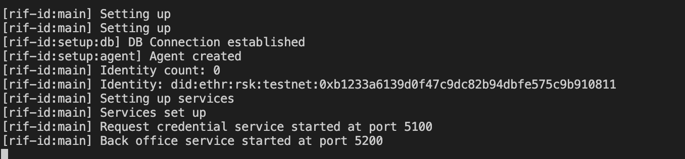

<p align="middle">
    
</p>
<h3 align="middle">W3C Verifiable Credential Issuer app</h3>
<p align="middle">
    RIF Self-sovereign identity
</p>

Application that allows receiving credential issuance requests and approving them manually.

## Features

- **Request credentials service**: receives Selective disclosure requests with simple key-value claims. This is a public service.
- **Back office**: now it requires a simple HTTP login to access a dashboard to allow or deny credentials

> **Use HTTPS (TLS)!** This server uses Basic HTTP auth now - see [RFC-7617](https://tools.ietf.org/html/rfc7617)

## Run

The issuer runs a back end with two express apps, one for the request credential HTTPS service and the other to serve information to the front end.

The front end can be run from [`@rsksmart/rif-identity-ui`](https://github.com/rsksmart/rif-identity-ui/tree/develop/apps/issuer-app)

> All commands can be run prepending  `:dev` for watch mode

1. Setup: create a `.env` file with

  ```
  SECRET_BOX_KEY= 32 random bytes in hex representation - encryption key
  ADMIN_PASS= a secure password for admin user - used for basic http auth
  ```

  Example:

  ```
  SECRET_BOX_KEY=29739248cad1bd1a0fc4d9b75cd4d2990de535baf5caadfdf8d8f86664aa830c
  ADMIN_PASS=Sup3r_4dm1N
  ```

  > See [optional configuration](#optional-configuration) to set service internals.

2. Install:

  ```
  npm i
  ```

3. Start

  ```
  npm run back
  # or back:dev
  ```

You should see the terminal running like this



Also a database file will be created. `issuer.sqlite`

## Optional configuration

Choose optionals:

```
DEBUG= rif-id:* for app logging - * for all logs
CREDENTIAL_REQUESTS_PORT= port to run credential requests service
SECRET_BOX_KEY= 32 random bytes in hex representation - encryption key
RPC_URL= rsk testnet rpc url - the one in the example was tested and works
LOG_FILE=relative path to the logs
LOG_ERRORS_FILE=relative path to the error logs
DB_FILE=relative path to the sqlite db
NODE_ENV=current environment
AUTH_EXPIRATION_HOURS=auth token expiration time in hours
CHALLENGE_EXPIRATION_SECONDS=auth challenge expiration time in seconds
MAX_REQUESTS_PER_TOKEN=max amount of requests allowed per token
NETWORK_NAME=network of the RPC url if set
```

Example

```
SECRET_BOX_KEY=29739248cad1bd1a0fc4d9b75cd4d2990de535baf5caadfdf8d8f86664aa830c
CREDENTIAL_REQUESTS_PORT=5100
REACT_APP_BACKOFFICE_PORT=5101
RPC_URL=https://did.testnet.rsk.co:4444
ADMIN_PASS=admin
LOG_FILE=./log/issuer-backend.log
LOG_ERRORS_FILE=./log/issuer-backend.error.log
DB_FILE=./db/issuer.sqlite
NODE_ENV=dev
AUTH_EXPIRATION_HOURS=10
CHALLENGE_EXPIRATION_SECONDS=300
MAX_REQUESTS_PER_TOKEN=20
```

Defaults

```
CREDENTIAL_REQUESTS_PORT=5100
REACT_APP_BACKOFFICE_PORT=5101
RPC_URL=https://did.testnet.rsk.co:4444
LOG_FILE=./log/issuer-backend.log
LOG_ERRORS_FILE=./log/issuer-backend.error.log
DB_FILE=./db/issuer.sqlite
NODE_ENV=dev
AUTH_EXPIRATION_HOURS=10
CHALLENGE_EXPIRATION_SECONDS=300
MAX_REQUESTS_PER_TOKEN=20
```
