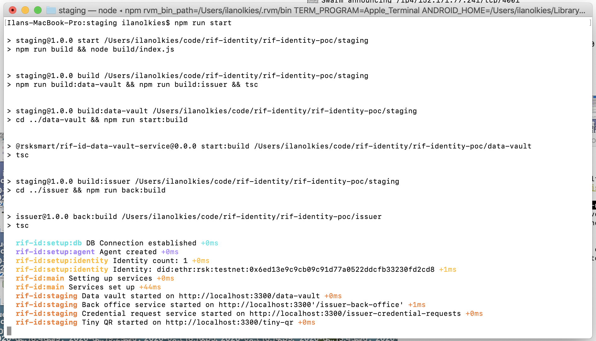

<p align="middle">
    
</p>
<h3 align="middle">Staging</h3>
<p align="middle">
    Put all RIF services on stage
</p>

The script in `src/index.ts` starts all the services in one single Express.js app. It routes the different services using url prefixes.

- **Data vault** starts on http://localhost:3300/data-vault
- **Back office service** started on http://localhost:3300'/issuer-back-office'
- **Credential request service** starts on http://localhost:3300/issuer-credential-requests
- **Tiny QR** starts on http://localhost:3300/tiny-qr

## Setup

1. First you need to install all services dependencies, go to each service folder and run

    ```
    npm install
    ```

2. Configure the services, a minimal config contains:

    ```
    DATA_VAULT_PRIVATE_KEY=
    DATA_VAULT_ADDRESS=
    ISSUER_ADMIN_PASS=
    ISSUER_SECRET_BOX_KEY=
    ```

3. Run the services

    ```
    npm run start
    ```

Starting the services will first compile all the services, then compile the staging script, and finally run it with Node.js

The result:


