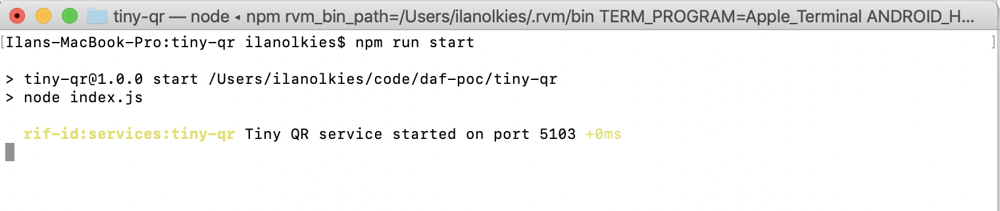

# Tiny-QR service

JWTs don't fit in QR codes so this service is designed to receive a JWT, store it, and create a URL to retrieve it. Instead of passing a JWT in the QR code you pass a the url to this service and a hash of the JWT to authenticate the service response.

```
Holder                            Tiny QR                 Verifier
 │                                   │                       │
 │ ── POST /presentation { jwt } ──> │ ──┐                   │
 │                                   │  store jwt            │
 │ <────── { url, pwd } ──────────── │ <─┘                   │
 │                                   │                       │
 │ ── QR { url, pwd, hash(jwt) } ──────────────────────────> │ ───┐
 │                                   │                       │  scan QR
 │                               ┌── │ <─ POST url { pwd } ─ │ <──┘
 │                     retrieve jwt  │                       │
 │                               └─> │ ────── { jwt } ─────> │ ───┐
 │                                   │                       │  verify hash
```

# Run

1. Install deps:

  ```
  npm i
  ```

2. Configure, create a .env file with

  ```
  TINY_QR_PORT=5103
  TINY_QR_URL=http://localhost:5103
  ```

  Ensure to put DNS in Tiny QR URL if used

3. Run

  ```
  npm run start
  # or npm run start:dev
  ```


